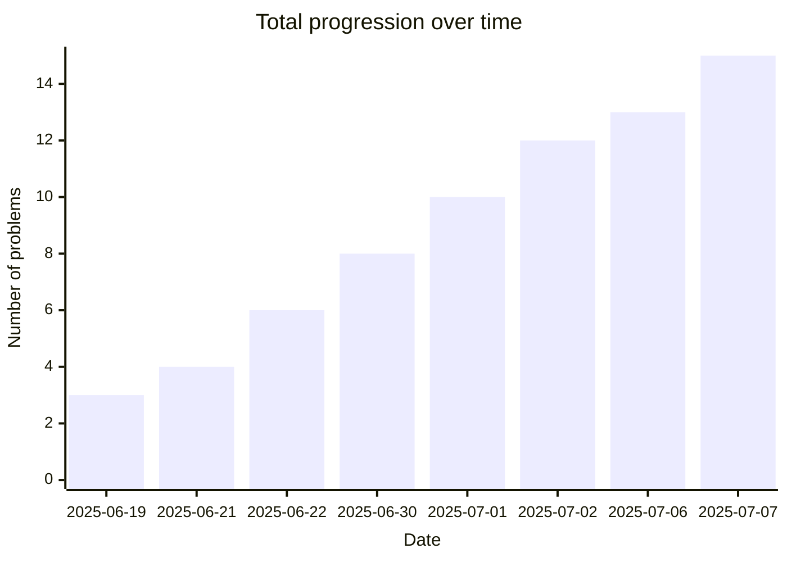

# leetcode-diary

This repository contains my journey to master Data Structures and Algorithms using LeetCode.
The progress is automatically updated by github actions using scripts that will count in the repo all solved problems,
and will generate / update READMEs accordingly.

## 📊 Total progress : 15 problems solved.

- Languages: Python
- Platforms: [LeetCode](https://leetcode.com/), [NeetCode](https://neetcode.io/)

## 📅 Problems solved by date

| Date | Problems |
|------|----------|
| 2025-06-19 | - Contains Duplicate - Two Sum - Valid Anagram |
| 2025-06-21 | - Group anagrams |
| 2025-06-22 | - Encode and Decode Strings - Top k frequent elements |
| 2025-06-30 | - Valid Palindrome - Valid Sudoku |
| 2025-07-01 | - Valid Parentheses - Longest Consecutive Sequence |
| 2025-07-02 | - Length of Last Word - Binary Search |
| 2025-07-06 | - Min Stack |
| 2025-07-07 | - Two Sum II - Input Array Is Sorted - Evaluate Reverse Polish Notation |

## 🧭 Roadmap

- Arrays & Hashing
- Two Pointers
- Sliding Window
- Stack
- Binary Search
- Trees
- Graphs

## 🗂️ Folder Structure

- `problems/` - Categorized problems with solutions
- `scripts/` - Automation or helper scripts

## 📌 Goals

- Solve at least 1 DSA problem per day
- Master the NeetCode 150 list
- Review difficult problems weekly
- Build and maintain this repo as a DSA portfolio